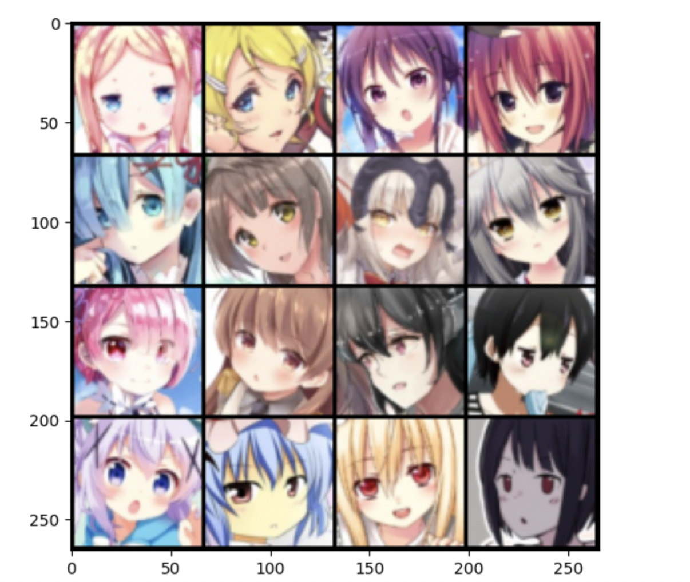

# Gan-AnimeImage

蹭的 Kaggle.com 的 GPU P100 跑的，因此用的 Jupyter Notebook，懒得改成 Python 代码

数据集: https://www.kaggle.com/datasets/liuxinleroy/animebest

``` Python
ckpt_dir = '/kaggle/working/' # 替换目录
faces_path = "/kaggle/input/animebest/faces"  # 替换目录
```

## 数据集



## Epoch

自己没卡，速度实在是太慢了，目前只跑了 10 个 epoch，感觉效果逐渐像个人

如果能跑满 100 个 epoch 效果应该会清晰点，等哪天出门去上课的时候把电脑挂在家里跑试试


-01 Epoch


-10 Epoch


## 更新

拿 4090 跑了个 200 个 epoch，效果好差，图片还是一坨狗屎，不知道增加转置卷积层 `nn.ConvTranspose2d` 效果能不能更好

-170 Epoch


-200 Epoch

